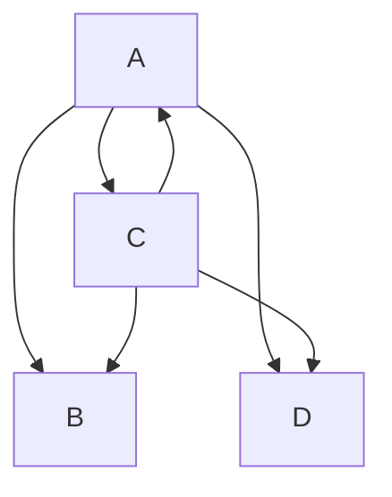
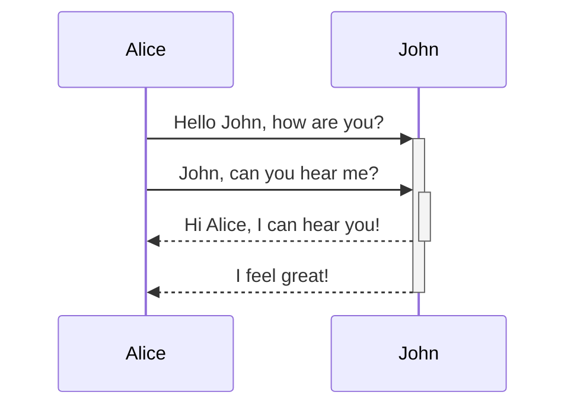
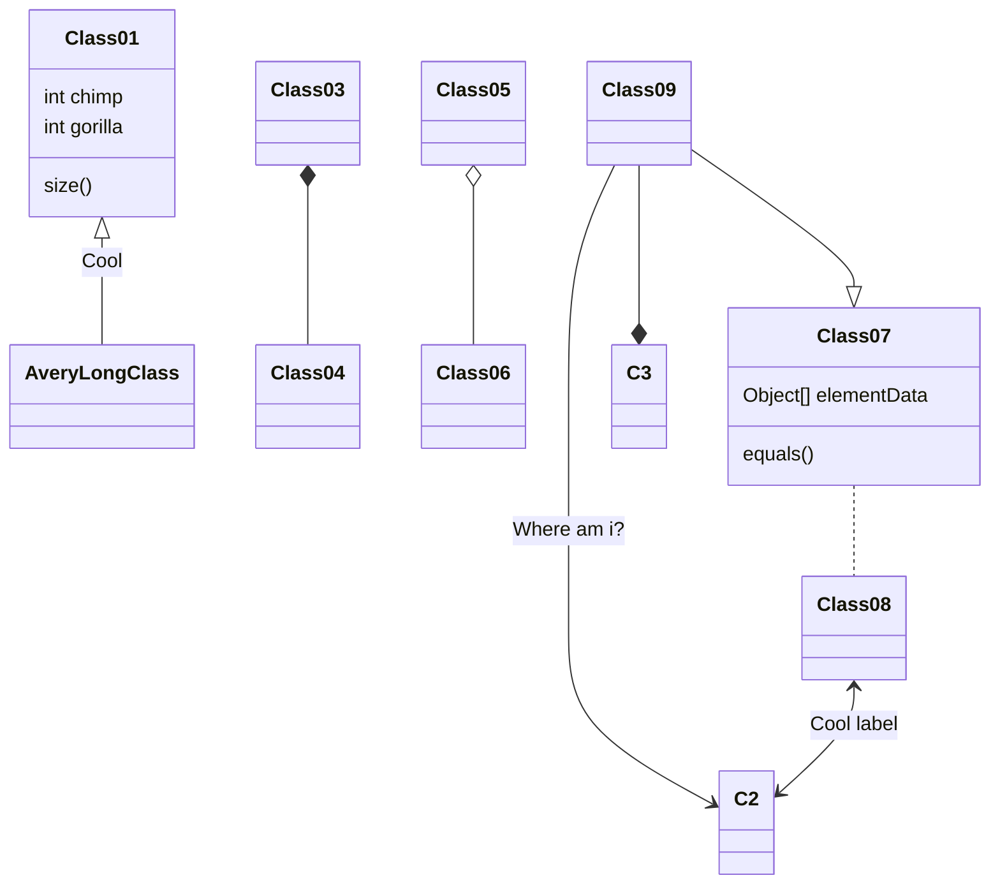

[Format your notes - Obsidian Help](https://help.obsidian.md/How+to/Format+your+notes)




First Header | Second Header 
------------ | ------------ 
Content from cell 1 | Content from cell 2 
Content in the first column | Content in the second column


```mermaid
erDiagram  
 CUSTOMER ||--o{ ORDER : places  
 ORDER ||--|{ LINE-ITEM : contains  
 CUSTOMER }|..|{ DELIVERY-ADDRESS : uses
 ```
 